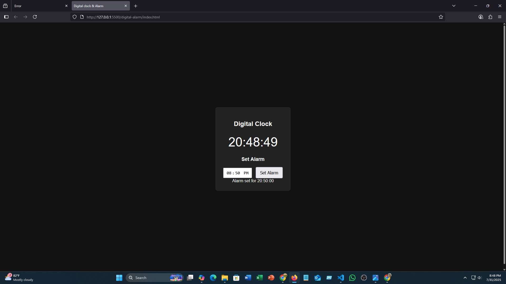

# digital-alarm

A sleek, simple, and fully responsive digital clock with alarm functionality.  
Built using **HTML**, **CSS**, and **Vanilla JavaScript**, this app showcases real-time time display and lets users set an alarm with ease.

---

## Features

-  Real-time digital clock (HH:MM:SS format)
-  Set alarm using modern time picker
-  Instant alert when alarm time is reached
-  Clean and responsive UI
-  Built with beginner-friendly yet professional JavaScript code

---

##  Screenshot



> Screenshot of the digital clock and alarm interface

---

## Live Demo

You can try the app here:  
 [https://sameul-islam.github.io/digital-clock-alarm](https://sameul-islam.github.io/digital-alarm)


---

##  How to Use

1. Clone the repository or download the zip:
    ```bash
    git clone https://github.com/sameul-islam/digital-alarm.git
    ```
2. Open `index.html` in your browser.
3. Set an alarm using the time input field.
4. Click **Set Alarm**.
5. Wait for the alarm to ring when time matches.

---

## Tech Stack

- **HTML5**
- **CSS3**
- **Vanilla JavaScript (ES6)**


